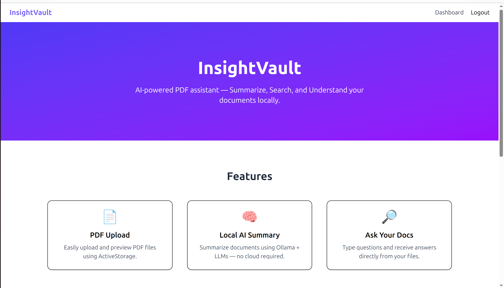
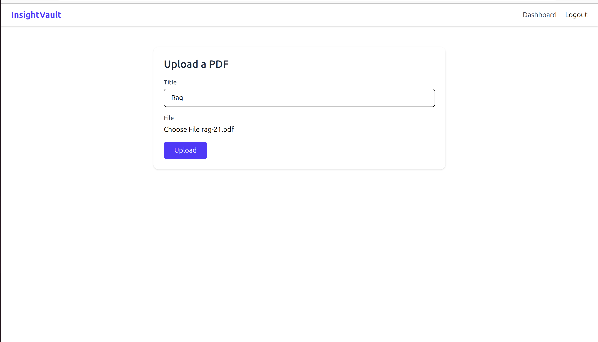
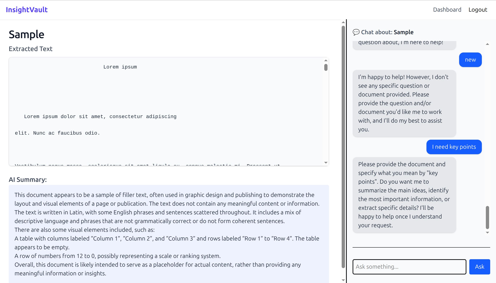
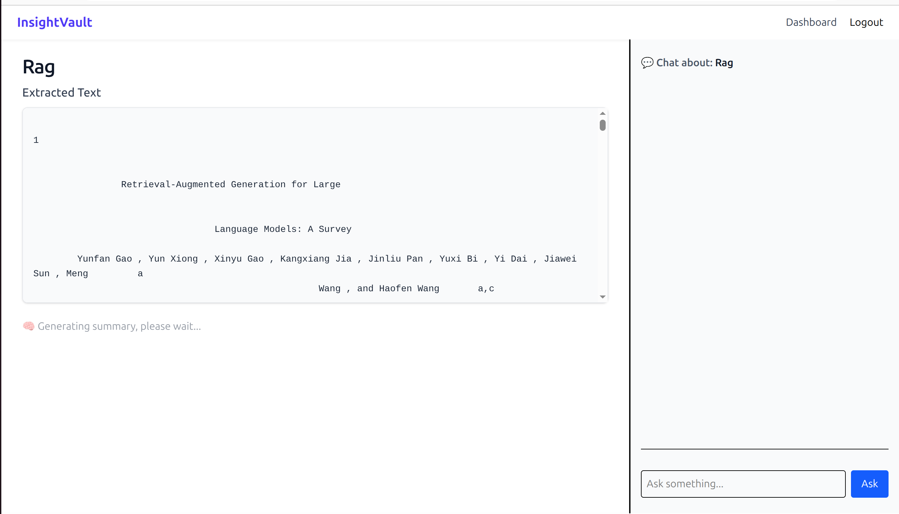

# InsightVault 🔍📄

**AI-powered PDF Assistant – Summarize, Search, and Understand Documents Locally**



---

## 🚀 What is InsightVault?

InsightVault is a local-first, privacy-focused Rails 8 app that allows users to:
- 📄 Upload and preview PDFs
- 🧠 Generate summaries using local AI models (via [Ollama](https://ollama.com))
- 🔎 Ask questions about document content
- ✅ 100% offline and open-source — your data never leaves your machine

Built with:
- Ruby on Rails 8
- TailwindCSS
- Turbo / Hotwire
- Ollama for local LLMs (Mistral, LLaMA, etc.)

---

## ✨ Features

- ✅ Upload PDFs via ActiveStorage
- ✅ Generate AI Summaries locally (no cloud calls)
- ✅ Chat/Ask Questions based on document content
- ✅ Offline support, perfect for secure environments
- ✅ Clean, modern UI (TailwindCSS)
- ✅ Devise authentication
- ✅ Admin dashboard for document management

---

## 🖥️ Screenshots

| Upload & Manage | Ask Questions | Summary |
|------------------|------------------|----------|
|  |  |  |

---

## 🛠️ Setup Instructions

### 1. Clone the Repository

```bash
git clone https://github.com/Rajdeep-coder/insightvault.git
cd insightvault
````

### 2. Install Dependencies

```bash
bundle install
yarn install
```

### 3. Set up the Database

```bash
rails db:setup
```

### 4. Start Ollama

Install [Ollama](https://ollama.com) and run a model:

```bash
ollama run llama3
```

You can also use `mistral`, `llama2`, `gemma`, or your own fine-tuned model.

### 5. Run the Rails Server

```bash
bin/dev
```

### 6. Run the Sidekiq & Redis Server
```bash
sidekiq
redis-server
```

Visit `http://localhost:3000`

---

## 📦 Deployment

This app is optimized for local use, but you can deploy it to a secure internal server or self-hosted environment.

---

## 🤝 Contributing

We welcome contributions! Here's how to get started:

1. Fork this repo
2. Create your feature branch:
   `git checkout -b feature/your-feature-name`
3. Commit your changes:
   `git commit -m "Add feature"`
4. Push to the branch:
   `git push origin feature/your-feature-name`
5. Open a Pull Request

> Make sure to follow our contributing guidelines (coming soon!)

---

## 📄 License

MIT License. See `LICENSE` file for details.

---

## 🙌 Acknowledgements

* [Ollama](https://ollama.com)
* [Ruby on Rails](https://rubyonrails.org)
* [TailwindCSS](https://tailwindcss.com)
* [Devise](https://github.com/heartcombo/devise)

---

## 📬 Contact / Feedback

Found a bug or have a feature request?
Open an issue or connect via [LinkedIn](https://www.linkedin.com/in/rajdeep-singh-panwar-81221b203/)
